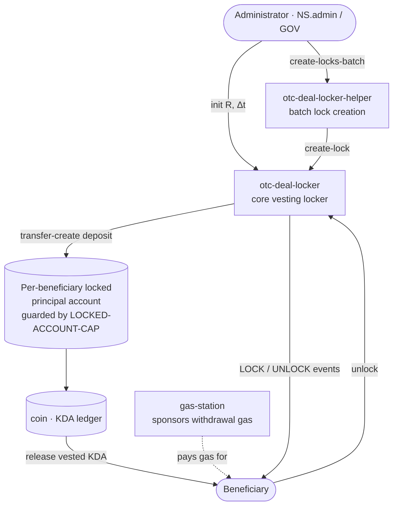
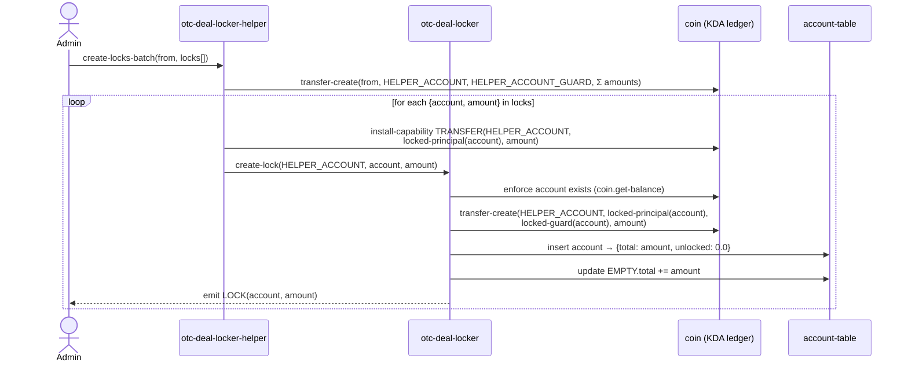
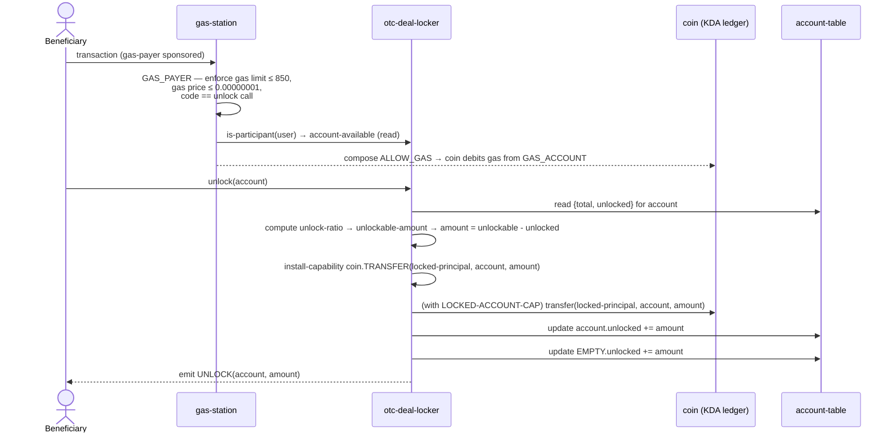

> **⚠ IMPORTANT — READ BEFORE CONTINUING**
>
> This document is **informational only**. It is **NOT a deployable contract** and **NOT legal advice**.
> It mirrors the immutable mainnet smart contracts at pinned commit [`820d69c`](https://github.com/CryptoPascal31/binance-otc-deal-locker/tree/820d69c837b6209d140e89b7c9aa3d97c710eb95).
> The deployed `.pact` files are the **sole source of truth**. If any statement in this document disagrees with the on-chain code, **the code wins**.

---

# Legal Mirror — Binance OTC Deal Locker

**Document type:** Companion / informational legal mirror  
**Pinned source commit:** `820d69c837b6209d140e89b7c9aa3d97c710eb95`  
**Mainnet namespace (`NS`):** `n_a93d47fd937a5d0899c9385763d5b1c4056842c5`  
**Source repository:** <https://github.com/CryptoPascal31/binance-otc-deal-locker>  
**Date authored:** 2026-06-19  

> **Namespace note.** Throughout the source code the placeholder `NS.` appears before module references (e.g. `NS.admin`, `NS.otc-deal-locker`). In the deployed contracts this prefix resolves to the full mainnet namespace `n_a93d47fd937a5d0899c9385763d5b1c4056842c5`. This document uses `NS.` as shorthand for that namespace when quoting code.

---

## Table of Contents

1. [Overview](#1-overview)
2. [Ecosystem Diagram](#2-ecosystem-diagram)
3. [Sequence Diagrams](#3-sequence-diagrams)
4. [Unlock Curve — Linear Vesting Explained](#4-unlock-curve--linear-vesting-explained)
5. [Legal Mirror — `otc_deal_locker.pact`](#5-legal-mirror--otc_deal_lockerpact)
6. [Legal Mirror — `otc_deal_locker_helper.pact`](#6-legal-mirror--otc_deal_locker_helperpact)
7. [Legal Mirror — `gas-station.pact`](#7-legal-mirror--gas-stationpact)
8. [Glossary](#8-glossary)

---

## 1. Overview

The **Binance OTC Deal Locker** is a set of three Kadena (KDA) smart contract modules that implement a **linear vesting / OTC distribution locker**. KDA tokens — acquired from Binance in an over-the-counter arrangement — are deposited into per-beneficiary on-chain custody accounts and released to community beneficiaries gradually over a fixed deal duration.

### The three modules

| Module | File | Role |
|--------|------|------|
| `otc-deal-locker` | `otc_deal_locker.pact` | Core vesting engine. Stores lock parameters, computes the unlock ratio, creates individual locks, and handles beneficiary withdrawals. |
| `otc-deal-locker-helper` | `otc_deal_locker_helper.pact` | Convenience batch-creation frontend. Allows the administrator to create many beneficiary locks in a single transaction. |
| `gas-station` | `gas-station.pact` | Pays the Kadena transaction fee (gas) on behalf of beneficiaries when they call `unlock`, so that beneficiaries receive their full vested KDA without needing to hold gas funds. |

**Key design choices for a non-technical reader:**

- Each beneficiary's locked KDA sits in a **self-custodied principal account on the `coin` (KDA) ledger** — not in a shared pool. The account's address is mathematically derived from a capability guard specific to that beneficiary, meaning no one (not even the administrator) can move those funds except through the locker's own logic.
- The vesting schedule is **linear**: an initial fraction `R` is available immediately at deal launch; the remainder unlocks continuously until the end of the deal period `Δt`.
- The administrator sets the parameters **once** via `init` and cannot change them after (without governance). Lock creation is **one-per-beneficiary account** — the code enforces no duplicate locks.
- The gas station **whitelists exactly one allowed transaction**: calling `otc-deal-locker.unlock`. No other use of the gas station is permitted.

---

## 2. Ecosystem Diagram



---

## 3. Sequence Diagrams

### 3a. Creating a Lock (batch path via helper)



### 3b. Withdrawing Vested KDA (unlock)



---

## 4. Unlock Curve — Linear Vesting Explained

### 4.1 The model in plain English

The deal unlocks KDA **linearly over time**. Two parameters are set by the administrator at launch:

- **R** — the *initial delivery ratio*: the fraction of each beneficiary's total allocation that is available immediately when the deal starts. For example, `R = 0.10` means 10% is immediately withdrawable at launch.
- **Δt** — the *total deal duration*, expressed in days. After `Δt` days have elapsed since launch, 100% is unlocked.

Between launch and the end of the deal, the available fraction grows smoothly from `R` to `1.0` (100%).

### 4.2 The formula

**Math notation:**

$$y(t) = \min\!\bigl(1.0,\; (t - T_0) \cdot \beta\bigr)$$

**Plain-text equivalent:**

```
unlock_ratio(t) = min(1.0,  (t - T0) * beta)
```

Where:
- `t` is the current block time.
- `T0` is the **virtual start time** — a timestamp computed by the contract to be *in the past*, so that `y(NOW) = R` at deal launch.
- `beta` is the **unlock rate per second**.

### 4.3 Derived parameters (set once in `init`)

The contract computes:

```
beta = (1 - R) / Δt          (in seconds, since Δt is converted to seconds via `days`)
T0   = NOW - (R / beta)      (shifts virtual origin into the past so R is already vested)
```

Plain-text check:
- At `t = NOW` (deal launch): `(NOW - T0) * beta = (R/beta) * beta = R` ✓
- At `t = NOW + Δt`: `(NOW + Δt - T0) * beta = R + (1-R) = 1.0` ✓

### 4.4 Vesting curve — ASCII sketch

```
Unlock
ratio
      │
 1.0  │                              ╔══════════════════ (capped)
      │                             /
      │                            /
  R   │·····················──────★  ← deal launch (t = NOW)
      │                          /
      │                         /
  0   │─────────────────────────
      └──────────────────────────────────────────────────▶  time
                      T0          NOW           NOW + Δt
                  (virtual,
                  in the past)
```

> The dotted segment from `T0` to just before launch is a mathematical extrapolation — it does not represent actual historical unlocks. `T0` is never before the actual deployment; it is computed such that exactly `R` of each allocation is vested on day one.

### 4.5 Effect on `account-available`

For a given beneficiary with `total` locked:

```
unlockable_amount = floor(total * unlock_ratio, coin.precision)
account_available = unlockable_amount - already_unlocked
```

A beneficiary can call `unlock` at any time; the contract transfers exactly `account_available` to them and records that amount as withdrawn so it cannot be claimed again.

---

## 5. Legal Mirror — `otc_deal_locker.pact`

> Source permalink base: <https://github.com/CryptoPascal31/binance-otc-deal-locker/blob/820d69c837b6209d140e89b7c9aa3d97c710eb95/otc_deal_locker.pact>

---

### Clause 5.1 — Module Declaration and Governance Authority

**Lines:** [L1](https://github.com/CryptoPascal31/binance-otc-deal-locker/blob/820d69c837b6209d140e89b7c9aa3d97c710eb95/otc_deal_locker.pact#L1), [L8–L10](https://github.com/CryptoPascal31/binance-otc-deal-locker/blob/820d69c837b6209d140e89b7c9aa3d97c710eb95/otc_deal_locker.pact#L8-L10)

**Plain language:** The module is named `otc-deal-locker` and is governed by the `GOV` capability. Only the holder of the `NS.admin` keyset — the project administrator — may exercise governance actions (such as upgrades), and only while the freeze guard is inactive.

```pact
(module otc-deal-locker GOV

  (defcap GOV:bool ()
    (enforce (not FROZEN-MODULE) "Governance locked")
    (enforce-keyset "NS.admin"))
```

**Implication for beneficiaries:** The administrator controls module upgrades. Beneficiaries should verify who holds the `NS.admin` keyset (`n_a93d47fd937a5d0899c9385763d5b1c4056842c5.admin`) on-chain.

---

### Clause 5.2 — Module Freeze Guard

**Lines:** [L6](https://github.com/CryptoPascal31/binance-otc-deal-locker/blob/820d69c837b6209d140e89b7c9aa3d97c710eb95/otc_deal_locker.pact#L6)

**Plain language:** The constant `FROZEN-MODULE` is set to `false` in the deployed code, meaning governance authority (upgrade rights) is currently active. If a future version were deployed with `FROZEN-MODULE = true`, governance would be permanently blocked — the module could never be upgraded again.

```pact
(defconst FROZEN-MODULE false)
```

**Implication:** Because this is the pinned immutable deployment, `FROZEN-MODULE` is permanently `false` for this version. Any upgraded version would appear as a new deployment and would be separately auditable.

---

### Clause 5.3 — Dependencies

**Lines:** [L3–L4](https://github.com/CryptoPascal31/binance-otc-deal-locker/blob/820d69c837b6209d140e89b7c9aa3d97c710eb95/otc_deal_locker.pact#L3-L4)

**Plain language:** The module imports two Kadena community utility libraries — `free.util-math` and `free.util-time`. Note that `diff-time` and `days`, used in the vesting math, are **native Pact builtins** (not provided by these libraries); `free.util-time` supplies helpers such as `now` and `from-now`.

```pact
(use free.util-math)
(use free.util-time)
```

---

### Clause 5.4 — Global Vesting Parameters Schema

**Lines:** [L12–L15](https://github.com/CryptoPascal31/binance-otc-deal-locker/blob/820d69c837b6209d140e89b7c9aa3d97c710eb95/otc_deal_locker.pact#L12-L15)

**Plain language:** The contract stores exactly two global vesting parameters on-chain: the virtual start time (`T0`) and the unlock rate per second (`beta`). These are derived from `R` and `Δt` at initialisation and remain fixed for the life of the deal.

```pact
(defschema global-sch
  virtual-start-time:time ; It's called virtual because adjusted according to initial unlock
  beta:decimal ; Unlock ratio-rate /second
)
```

---

### Clause 5.5 — Per-Beneficiary Lock Record Schema

**Lines:** [L17–L20](https://github.com/CryptoPascal31/binance-otc-deal-locker/blob/820d69c837b6209d140e89b7c9aa3d97c710eb95/otc_deal_locker.pact#L17-L20)

**Plain language:** For each beneficiary (and for the aggregate "EMPTY" record), the contract stores two figures: the total KDA locked for that beneficiary, and the cumulative amount already withdrawn. The difference, adjusted by the current unlock ratio, determines what is currently available to withdraw.

```pact
(defschema account-sch
  total:decimal ; Total locked
  unlocked:decimal ; Previously already unlocked
)
```

---

### Clause 5.6 — Storage Tables

**Lines:** [L22](https://github.com/CryptoPascal31/binance-otc-deal-locker/blob/820d69c837b6209d140e89b7c9aa3d97c710eb95/otc_deal_locker.pact#L22), [L24](https://github.com/CryptoPascal31/binance-otc-deal-locker/blob/820d69c837b6209d140e89b7c9aa3d97c710eb95/otc_deal_locker.pact#L24)

**Plain language:** Two on-chain database tables are declared: `global-table` holds the single row of deal-wide parameters (`T0` and `beta`), and `account-table` holds one row per beneficiary plus the aggregate EMPTY row.

```pact
(deftable global-table:{global-sch})

(deftable account-table:{account-sch})
```

---

### Clause 5.7 — EMPTY / Global Aggregate Account Convention

**Lines:** [L25–L26](https://github.com/CryptoPascal31/binance-otc-deal-locker/blob/820d69c837b6209d140e89b7c9aa3d97c710eb95/otc_deal_locker.pact#L25-L26)

**Plain language:** The empty string (`""`) is a reserved key in `account-table` used exclusively as a global aggregation row — it tracks the sum of all locked amounts and all amounts withdrawn across the entire deal. It does not represent any individual beneficiary and cannot be used as a withdrawal account.

```pact
; IMPORTANT NOTE , as a convention, empty account (ie "") represents sums of Data (for stats)
(defconst EMPTY "")
```

---

### Clause 5.8 — Custody of Locked Funds (LOCKED-ACCOUNT-CAP)

**Lines:** [L29–L30](https://github.com/CryptoPascal31/binance-otc-deal-locker/blob/820d69c837b6209d140e89b7c9aa3d97c710eb95/otc_deal_locker.pact#L29-L30)

**Plain language:** The `LOCKED-ACCOUNT-CAP` capability is the **custody guardian** of each beneficiary's locked funds. A beneficiary's locked KDA account on the `coin` ledger is guarded by this capability. The `coin` ledger will refuse any transfer out of that account unless `LOCKED-ACCOUNT-CAP` is active — and the only code that activates it is the `unlock` function inside this module. No external party, including the administrator, can move funds out of a beneficiary's locked account by any other means.

```pact
(defcap LOCKED-ACCOUNT-CAP (account:string)
  true)
```

**Significance:** This is the primary security property of the contract. The `with-capability (LOCKED-ACCOUNT-CAP account)` block inside `unlock` (see Clause 5.18) is the only path by which funds leave custody.

---

### Clause 5.9 — Locked-Account Address Derivation

**Lines:** [L32–L33](https://github.com/CryptoPascal31/binance-otc-deal-locker/blob/820d69c837b6209d140e89b7c9aa3d97c710eb95/otc_deal_locker.pact#L32-L33), [L35–L36](https://github.com/CryptoPascal31/binance-otc-deal-locker/blob/820d69c837b6209d140e89b7c9aa3d97c710eb95/otc_deal_locker.pact#L35-L36)

**Plain language:** For each beneficiary account name, the contract deterministically derives two things: (a) a **guard** — the rule that the coin ledger enforces before allowing a transfer out of the locked account; and (b) a **principal address** — the unique, verifiable on-chain address of the locked account itself. Because the address is derived from the guard, anyone who knows a beneficiary's account name can recompute and verify the corresponding locked-account address. The reverse does not hold: you cannot recover the beneficiary account from a locked-account address, because capability-guard principals are produced by a one-way hash (the `c:` principal form).

```pact
(defun locked-account-guard:guard (account:string)
  (create-capability-guard (LOCKED-ACCOUNT-CAP account)))

(defun locked-account-principal:string (account:string)
  (create-principal (locked-account-guard account)))
```

---

### Clause 5.10 — Audit Trail Events

**Lines:** [L39–L41](https://github.com/CryptoPascal31/binance-otc-deal-locker/blob/820d69c837b6209d140e89b7c9aa3d97c710eb95/otc_deal_locker.pact#L39-L41), [L43–L45](https://github.com/CryptoPascal31/binance-otc-deal-locker/blob/820d69c837b6209d140e89b7c9aa3d97c710eb95/otc_deal_locker.pact#L43-L45)

**Plain language:** Every lock creation emits a `LOCK` event and every withdrawal emits an `UNLOCK` event on the Kadena blockchain. These events — recording the beneficiary account and the KDA amount — are permanently and publicly visible in block history and can be queried by indexers or block explorers without access to private information.

```pact
(defcap LOCK (account:string amount:decimal)
  @event
  true)

(defcap UNLOCK (account:string amount:decimal)
  @event
  true)
```

---

### Clause 5.11 — Account Existence Check

**Lines:** [L47–L49](https://github.com/CryptoPascal31/binance-otc-deal-locker/blob/820d69c837b6209d140e89b7c9aa3d97c710eb95/otc_deal_locker.pact#L47-L49)

**Plain language:** This helper checks whether a given account already exists on the `coin` (KDA) ledger by attempting to read its balance and treating a failure as non-existence. It is used by `create-lock` to enforce that a beneficiary's receiving account exists before funds are locked for them.

```pact
(defun account-exists:bool (account:string)
  @doc "Does a coin account exist ?"
  (!= -1.0 (try -1.0 (coin.get-balance account))))
```

---

### Clause 5.12 — Ratio Cap (Maximum 100%)

**Lines:** [L51–L53](https://github.com/CryptoPascal31/binance-otc-deal-locker/blob/820d69c837b6209d140e89b7c9aa3d97c710eb95/otc_deal_locker.pact#L51-L53)

**Plain language:** The linear formula can arithmetically exceed 1.0 after the deal period ends. This helper clamps the unlock ratio to a maximum of 1.0 (100%), ensuring no beneficiary can ever be entitled to more than their full locked amount.

```pact
(defun with-cap:decimal (x:decimal)
  @doc "Cap an amount to 1.0"
  (min 1.0 x))
```

---

### Clause 5.13 — Vesting Rate: The Unlock Ratio (Core Vesting Clause)

**Lines:** [L64–L67](https://github.com/CryptoPascal31/binance-otc-deal-locker/blob/820d69c837b6209d140e89b7c9aa3d97c710eb95/otc_deal_locker.pact#L64-L67)

**Plain language:** This function computes the current global unlock ratio — the fraction of all locked funds that is now vested — by reading the stored `beta` and `T0` from `global-table` and applying the linear formula `(t - T0) * beta`, capped at 1.0. The result is the same for all beneficiaries at any given moment because it depends only on clock time and the deal-wide parameters.

```pact
(defun unlock-ratio:decimal ()
  @doc "Return the current global unlock ratio"
  (with-read global-table "" {'virtual-start-time:=start-time, 'beta:=beta}
    (with-cap (* beta (diff-time (now) start-time)))))
```

The code reads the row keyed by `""` (the global row in `global-table`) to retrieve `T0` (`start-time`) and `beta`, then computes `(now - T0) * beta` and caps it at `1.0` via `with-cap`.

---

### Clause 5.14 — Unlockable Amount

**Lines:** [L69–L72](https://github.com/CryptoPascal31/binance-otc-deal-locker/blob/820d69c837b6209d140e89b7c9aa3d97c710eb95/otc_deal_locker.pact#L69-L72)

**Plain language:** Given a beneficiary's total locked amount, this function returns the absolute KDA quantity that is currently vested (before subtracting prior withdrawals). It applies the global unlock ratio and floors the result to the `coin` ledger's precision (12 decimal places — KDA's `coin.precision`), preventing fractional-unit rounding issues.

```pact
(defun unlockable-amount:decimal (total:decimal)
  @doc "Absolute unlockable amount based on a total amount"
  (floor (* total (unlock-ratio))
         (coin.precision)))
```

---

### Clause 5.15 — Amount Available for Withdrawal

**Lines:** [L74–L77](https://github.com/CryptoPascal31/binance-otc-deal-locker/blob/820d69c837b6209d140e89b7c9aa3d97c710eb95/otc_deal_locker.pact#L74-L77)

**Plain language:** For a specific beneficiary account, this function computes how much KDA can be withdrawn right now: it is the currently unlockable amount minus the amount already withdrawn in prior calls. This is the figure that `unlock` actually transfers.

```pact
(defun account-available:decimal (account:string)
  @doc "Amount available for an account: (ie Unlockable but not already withdrawn)"
  (with-read account-table account {'total:=total, 'unlocked:=unlocked}
    (- (unlockable-amount total) unlocked)))
```

---

### Clause 5.16 — Frontend State Queries

**Lines:** [L79–L82](https://github.com/CryptoPascal31/binance-otc-deal-locker/blob/820d69c837b6209d140e89b7c9aa3d97c710eb95/otc_deal_locker.pact#L79-L82) (account-state), [L84–L86](https://github.com/CryptoPascal31/binance-otc-deal-locker/blob/820d69c837b6209d140e89b7c9aa3d97c710eb95/otc_deal_locker.pact#L84-L86) (global-state)

**Plain language:** These two read-only helpers allow user interfaces and dashboards to display the current state of any beneficiary account (`account-state`) or the deal as a whole (`global-state`). They return an object combining the stored `{total, unlocked}` fields with the computed `available` amount. They do not modify any state.

```pact
(defun account-state:object (account:string)
  @doc "Return state for an account (for Frontend)"
  (+ {'available: (account-available account)}
     (read account-table account)))

(defun global-state:object ()
  @doc "Return global state (for Frontend)"
  (account-state EMPTY))
```

---

### Clause 5.17 — Empty Account Guard

**Lines:** [L88–L90](https://github.com/CryptoPascal31/binance-otc-deal-locker/blob/820d69c837b6209d140e89b7c9aa3d97c710eb95/otc_deal_locker.pact#L88-L90)

**Plain language:** This guard prevents either `unlock` or `create-lock` from being called with the empty string (`""`) as the beneficiary account name, since that key is reserved for global aggregate statistics. Attempting to use `""` as an account will fail with the message "Empty account is reserved."

```pact
(defun enforce-no-empty-account:bool (account:string)
  @doc "Pure form sanity check, since coin refuses empty account anyway"
  (enforce (!= EMPTY account) "Empty account is reserved"))
```

---

### Clause 5.18 — Withdrawal Rights: `unlock` (The Beneficiary Claim Function)

**Lines:** [L93–L113](https://github.com/CryptoPascal31/binance-otc-deal-locker/blob/820d69c837b6209d140e89b7c9aa3d97c710eb95/otc_deal_locker.pact#L93-L113)

**Plain language:** `unlock` is the primary function through which a beneficiary claims their vested KDA. When called with a beneficiary's account name, it: (1) verifies the account is not the reserved EMPTY account; (2) computes the currently available amount; (3) transfers that amount from the beneficiary's locked principal account to their ordinary coin account; (4) records the withdrawal in both the individual and aggregate ledger rows; and (5) emits an `UNLOCK` event for on-chain transparency.

**Assumption stated in the code:** The in-code comment at L100 reads: `; Assume account already exists at this point`. The beneficiary's destination coin account is guaranteed to exist when `unlock` is called, because its existence was verified at lock creation (Clause 5.19) and **coin accounts cannot be deleted on Kadena**. The assumption therefore always holds, and `unlock` never fails for a missing destination account.

```pact
(defun unlock:bool (account:string)
  @doc "Main function to withdraw available unlocked amount for an account"

  (enforce-no-empty-account account)

  (let ((amount (account-available account)))
    (install-capability (coin.TRANSFER (locked-account-principal account) account amount))
    ; Assume account already exists at this point
    (with-capability (LOCKED-ACCOUNT-CAP account)
      (coin.transfer (locked-account-principal account) account amount))

    ; Increase user already unlocked amount
    (with-read account-table account {'unlocked:=unlocked}
      (update  account-table account {'unlocked:(+ amount unlocked)}))

    ; Increase global already unlocked amount
    (with-read account-table EMPTY {'unlocked:=unlocked}
      (update  account-table EMPTY {'unlocked:(+ amount unlocked)}))
    (emit-event (UNLOCK account amount)))
)
```

**Security note:** The transfer is gated by `(with-capability (LOCKED-ACCOUNT-CAP account) ...)`. The `coin` ledger enforces that this capability is present before allowing the transfer from the locked principal account. Because `LOCKED-ACCOUNT-CAP` is a capability guard on that account, no other code path — inside or outside this module — can authorize this transfer.

---

### Clause 5.19 — Lock Creation and Fund Deposit: `create-lock`

**Lines:** [L115–L138](https://github.com/CryptoPascal31/binance-otc-deal-locker/blob/820d69c837b6209d140e89b7c9aa3d97c710eb95/otc_deal_locker.pact#L115-L138)

**Plain language:** `create-lock` is the administrator function (called directly or via the helper) that establishes a beneficiary's locked allocation. It verifies the beneficiary's coin account exists, transfers the specified KDA amount from the funding source into the beneficiary's locked principal account (under the `LOCKED-ACCOUNT-CAP` guard), records the allocation in `account-table`, updates the global total, and emits a `LOCK` event.

**Stated assumptions and limitations:**

1. **One lock per account (no duplicates).** The code comment at L130 reads: `; Wa assume that no previous lock already exists for this account => No multiple locks per account`. The function uses `insert` (not `write`), which fails if a row for that account already exists. If `create-lock` is called twice for the same beneficiary account, the second call will revert. This is a hard constraint: one account may hold exactly one lock. **Rationale:** disallowing multiple locks per account keeps the contract simple — the lock and unlock logic never needs to reconcile or recompute a beneficiary's state against a pre-existing lock.
2. **Beneficiary account must pre-exist.** The code checks `(account-exists account)` at L125 and enforces it. The administrator must ensure each beneficiary has an existing KDA account before creating their lock. **Rationale:** verifying existence up front guarantees the later `unlock` transfer can never fail for a missing destination account — and because coin accounts cannot be deleted, that guarantee is permanent (see Clause 5.18).
3. **Access control is partial.** The function is not restricted to the administrator by capability. Any caller who holds the `coin.TRANSFER` managed capability for the funding source can call `create-lock`. In practice the helper (called under admin control) is the expected caller. The in-code comment notes this design choice explicitly.

```pact
(defun create-lock:bool (from:string account:string amount:decimal)
  @doc "Admin function to create a lock and transfer money for an account"

  (enforce-no-empty-account account)

  ; Check first that target account exist; before creating a lock
  ; because it's assumed in the unlock function
  (enforce (account-exists account) (format "{} doesn't exist" [account]))

  ; We assume that the caller already set-up the managed cap
  (coin.transfer-create from (locked-account-principal account) (locked-account-guard account) amount)

  ; Wa assume that no previous lock already exists for this account => No multiple locks per account
  (insert account-table account {'total:amount, 'unlocked:0.0})

  ; Increase global (total) amount
  (with-read account-table EMPTY {'total:=total}
    (update  account-table EMPTY {'total:(+ amount total)}))

  (emit-event (LOCK account amount))
)
```

---

### Clause 5.20 — Deal Initialization: `init`

**Lines:** [L155–L170](https://github.com/CryptoPascal31/binance-otc-deal-locker/blob/820d69c837b6209d140e89b7c9aa3d97c710eb95/otc_deal_locker.pact#L155-L170)

**Plain language:** `init` is the one-time setup function that establishes the entire vesting schedule. The administrator calls it with `R` (the initial delivery ratio, a decimal between 0 and 1) and `delta-T-days` (the deal duration in days). The function requires the `GOV` (governance) capability — only the `NS.admin` keyset holder may call it. It computes `beta` and the virtual start time `T0`, stores them in `global-table`, and initialises the aggregate EMPTY row in `account-table`. Because `global-table` uses `insert` (not `write`), calling `init` a second time will fail — the deal parameters are immutable once set.

```pact
(defun init:string (R:decimal delta-T-days:decimal)
  (with-capability (GOV)
    (let ((beta (/ (- 1.0 R)
                   (days delta-T-days)))

          (t0 (from-now (/ (- R)
                           beta))))

      ; Init the settings table
      (insert global-table "" {'virtual-start-time:t0,
                               'beta:(round beta 18)}))
    ; Init the EMPTY (global) account
    (insert account-table EMPTY {'total:0.0, 'unlocked:0.0}))
)
```

**Mathematical note:** `(from-now x)` returns `NOW + x`. Since `(/ (- R) beta)` is a negative duration (because `R` is positive), `T0 = NOW + (-R/beta) = NOW - R/beta`, which places `T0` in the past. `beta` is rounded to 18 decimal places to maintain sufficient precision for long-duration deals. See Section 4 for the full derivation.

---

## 6. Legal Mirror — `otc_deal_locker_helper.pact`

> Source permalink base: <https://github.com/CryptoPascal31/binance-otc-deal-locker/blob/820d69c837b6209d140e89b7c9aa3d97c710eb95/otc_deal_locker_helper.pact>

---

### Clause 6.1 — Module Declaration and Purpose

**Lines:** [L1–L3](https://github.com/CryptoPascal31/binance-otc-deal-locker/blob/820d69c837b6209d140e89b7c9aa3d97c710eb95/otc_deal_locker_helper.pact#L1-L3)

**Plain language:** This module's declared purpose (in its `@doc` annotation) is "A frontend to create multiple lock accounts." It is a convenience wrapper that allows the administrator to fund and create all beneficiary locks in a single transaction rather than one at a time. It imports `free.util-math` for the `sum` function used to aggregate amounts.

```pact
(module otc-deal-locker-helper GOV
  @doc "A frontend to create multiple lock accounts"
  (use free.util-math)
```

---

### Clause 6.2 — Governance Authority

**Lines:** [L5–L6](https://github.com/CryptoPascal31/binance-otc-deal-locker/blob/820d69c837b6209d140e89b7c9aa3d97c710eb95/otc_deal_locker_helper.pact#L5-L6)

**Plain language:** Like the core locker, the helper module is governed exclusively by the `NS.admin` keyset. Module upgrades require the administrator's signature.

```pact
(defcap GOV:bool ()
  (enforce-keyset "NS.admin"))
```

---

### Clause 6.3 — Lock Info Data Structure

**Lines:** [L8–L11](https://github.com/CryptoPascal31/binance-otc-deal-locker/blob/820d69c837b6209d140e89b7c9aa3d97c710eb95/otc_deal_locker_helper.pact#L8-L11)

**Plain language:** Each entry in the batch is described by a simple two-field record: `account` (the beneficiary's KDA account name) and `amount` (the KDA quantity to lock for that beneficiary). This schema is used only within the helper to type-check the input list.

```pact
(defschema lock-info-sch
  account:string
  amount:decimal
)
```

---

### Clause 6.4 — Helper Custody Account (Intermediate Staging)

**Lines:** [L14–L15](https://github.com/CryptoPascal31/binance-otc-deal-locker/blob/820d69c837b6209d140e89b7c9aa3d97c710eb95/otc_deal_locker_helper.pact#L14-L15), [L17](https://github.com/CryptoPascal31/binance-otc-deal-locker/blob/820d69c837b6209d140e89b7c9aa3d97c710eb95/otc_deal_locker_helper.pact#L17), [L19](https://github.com/CryptoPascal31/binance-otc-deal-locker/blob/820d69c837b6209d140e89b7c9aa3d97c710eb95/otc_deal_locker_helper.pact#L19)

**Plain language:** The helper uses its own intermediate custody account on the `coin` ledger (`HELPER-ACCOUNT`) as a temporary staging area. The batch operation first moves the total KDA from the administrator's source account into this helper account, then atomically routes each individual amount to the respective beneficiary's locked principal account. The helper account's guard (`HELPER-ACCOUNT-GUARD`) is a capability guard backed by `HELPER-ACCOUNT-CAP`, so only this module's own code can authorize transfers out of it.

```pact
(defcap HELPER-ACCOUNT-CAP ()
  true)

(defconst HELPER-ACCOUNT-GUARD (create-capability-guard (HELPER-ACCOUNT-CAP)))

(defconst HELPER-ACCOUNT (create-principal HELPER-ACCOUNT-GUARD))
```

**Significance:** Because the entire batch executes in a single Kadena transaction, it is atomic — either all locks are created and all funds move correctly, or the entire transaction reverts and no state changes. There is no partial-completion risk at the blockchain level.

---

### Clause 6.5 — Batch Lock Creation: `create-locks-batch`

**Lines:** [L21–L34](https://github.com/CryptoPascal31/binance-otc-deal-locker/blob/820d69c837b6209d140e89b7c9aa3d97c710eb95/otc_deal_locker_helper.pact#L21-L34)

**Plain language:** `create-locks-batch` accepts a source account (`from`) and a list of `{account, amount}` records. It: (1) moves the total of all amounts from `from` to the helper's staging account in one `coin.transfer-create`; then (2) for each lock entry, installs the `coin.TRANSFER` capability and calls `otc-deal-locker.create-lock` to move the individual amount from the staging account into the beneficiary's locked principal account. The function returns `true` on success.

```pact
(defun create-locks-batch:bool (from:string locks:[object{lock-info-sch}])
  @doc "Helper to create multiple locks at aonce"

  ; Transfer the total to the helper account
  (coin.transfer-create from HELPER-ACCOUNT HELPER-ACCOUNT-GUARD (sum (map (at'amount) locks)))

  ; Then transfer all locks
  (map (lambda (lock) (bind lock {'account:=acct, 'amount:=am}
                        (install-capability (coin.TRANSFER HELPER-ACCOUNT (otc-deal-locker.locked-account-principal acct) am))
                        (with-capability (HELPER-ACCOUNT-CAP)
                          (otc-deal-locker.create-lock HELPER-ACCOUNT acct am))))
        locks)
  true
)
```

**Limitation inherited from `create-lock`:** All constraints of `create-lock` apply per entry — specifically, each beneficiary account must already exist on the coin ledger, and no account may appear more than once in the batch (the second occurrence would fail on `insert`). See Clause 5.19.

---

## 7. Legal Mirror — `gas-station.pact`

> Source permalink base: <https://github.com/CryptoPascal31/binance-otc-deal-locker/blob/820d69c837b6209d140e89b7c9aa3d97c710eb95/gas-station.pact>

---

### Clause 7.1 — Module Declaration and Interface Implementation

**Lines:** [L1](https://github.com/CryptoPascal31/binance-otc-deal-locker/blob/820d69c837b6209d140e89b7c9aa3d97c710eb95/gas-station.pact#L1), [L3–L5](https://github.com/CryptoPascal31/binance-otc-deal-locker/blob/820d69c837b6209d140e89b7c9aa3d97c710eb95/gas-station.pact#L3-L5)

**Plain language:** The `gas-station` module is declared to implement the Kadena standard `gas-payer-v1` interface, which is the recognised on-chain protocol for third-party transaction fee (gas) sponsorship. By implementing this interface, the gas station is recognised by Kadena node software as an authorised payer for transactions that reference it. It also imports `coin` (the KDA ledger) and `free.util-chain-data` (for reading transaction metadata).

```pact
(module gas-station GOV

  (implements gas-payer-v1)
  (use coin)
  (use free.util-chain-data)
```

---

### Clause 7.2 — Gas Limit and Price Caps

**Lines:** [L7–L8](https://github.com/CryptoPascal31/binance-otc-deal-locker/blob/820d69c837b6209d140e89b7c9aa3d97c710eb95/gas-station.pact#L7-L8)

**Plain language:** The gas station will only sponsor transactions whose declared gas limit does not exceed 850 units and whose gas price does not exceed 0.00000001 KDA per unit. These hard-coded caps protect the gas station's funds from over-spending by any single sponsorship. The maximum conceivable gas cost per sponsored transaction is therefore `850 × 0.00000001 = 0.0000085 KDA`.

```pact
(defconst GAS_LIMIT 850)
(defconst GAS_PRICE 0.00000001)
```

---

### Clause 7.3 — Permitted Transaction Code Whitelist

**Lines:** [L10](https://github.com/CryptoPascal31/binance-otc-deal-locker/blob/820d69c837b6209d140e89b7c9aa3d97c710eb95/gas-station.pact#L10)

**Plain language:** The gas station will only pay for transactions that execute **exactly one specific piece of code**: a call to `NS.otc-deal-locker.unlock` with the account read from the transaction's signed data. Any transaction that executes different code — even another function in the same module — will be rejected by the gas station. This prevents the gas station from being exploited to pay for unrelated transactions.

```pact
(defconst CODE:[string] ["(NS.otc-deal-locker.unlock (read-string 'account))"])
```

**Note on `NS.`:** In this constant, `NS.` is the literal namespace prefix as it appears in the transaction code string. At runtime on mainnet, `NS` resolves to `n_a93d47fd937a5d0899c9385763d5b1c4056842c5`.

---

### Clause 7.4 — Gas Station Account

**Lines:** [L12](https://github.com/CryptoPascal31/binance-otc-deal-locker/blob/820d69c837b6209d140e89b7c9aa3d97c710eb95/gas-station.pact#L12)

**Plain language:** The gas station's own KDA account address (`GAS_ACCOUNT`) is a principal derived from the gas payer guard. Like the beneficiary locked accounts, this address is mathematically tied to its guard — ensuring that only the gas station's own logic (`payer` function) can authorize disbursements. The account must be funded by the administrator via `init`.

```pact
(defconst GAS_ACCOUNT:string (create-principal (create-gas-payer-guard)))
```

---

### Clause 7.5 — Governance Authority

**Lines:** [L14–L15](https://github.com/CryptoPascal31/binance-otc-deal-locker/blob/820d69c837b6209d140e89b7c9aa3d97c710eb95/gas-station.pact#L14-L15)

**Plain language:** The gas station module is also governed by the `NS.admin` keyset, consistent with the other two modules. All three modules share the same governance authority.

```pact
(defcap GOV:bool ()
  (enforce-keyset "NS.admin"))
```

---

### Clause 7.6 — Participant Verification Helpers

**Lines:** [L17–L18](https://github.com/CryptoPascal31/binance-otc-deal-locker/blob/820d69c837b6209d140e89b7c9aa3d97c710eb95/gas-station.pact#L17-L18) (try-available), [L20–L21](https://github.com/CryptoPascal31/binance-otc-deal-locker/blob/820d69c837b6209d140e89b7c9aa3d97c710eb95/gas-station.pact#L20-L21) (is-participant), [L23–L24](https://github.com/CryptoPascal31/binance-otc-deal-locker/blob/820d69c837b6209d140e89b7c9aa3d97c710eb95/gas-station.pact#L23-L24) (env-account)

**Plain language:** Before paying gas, the gas station verifies that the caller is a real beneficiary in the deal — specifically, that they have a non-zero available balance in `otc-deal-locker`. `try-available` safely queries the locker (returning 0.0 if the account is unknown); `is-participant` confirms the available amount is non-zero; `env-account` reads the account name from the transaction's signed data envelope. Together these prevent the gas station from being used by accounts that are not part of the deal.

```pact
(defun try-available:decimal (account:string)
  (try 0.0 (NS.otc-deal-locker.account-available account)))

(defun is-participant:bool (user:string)
  (!= 0.0 (try-available user)))

(defun env-account:string ()
  (at'account (read-msg 'exec-user-data)))
```

---

### Clause 7.7 — Gas Sponsorship Gate: `GAS_PAYER` (The Sponsorship Clause)

**Lines:** [L26–L40](https://github.com/CryptoPascal31/binance-otc-deal-locker/blob/820d69c837b6209d140e89b7c9aa3d97c710eb95/gas-station.pact#L26-L40)

**Plain language:** `GAS_PAYER` is the central capability of the gas station. It is called automatically by the Kadena node when a transaction nominates this module as its gas payer. It enforces **six sequential checks** before agreeing to pay:

1. Gas limit is valid: the submitted `limit` is greater than or equal to the actual `(gas-limit)` and is within the `GAS_LIMIT` ceiling of `850`.
2. Gas price is valid: the submitted `price` is greater than or equal to the actual `(gas-price)` and is within the `GAS_PRICE` ceiling of `0.00000001`.
3. Transaction type is `exec` (`tx-type == "exec"`).
4. The transaction code is exactly the whitelisted `CODE` value: the single `otc-deal-locker.unlock` call.
5. Account validity: the caller `user` equals the account named in the transaction data envelope (`env-account`) and `user` is not the reserved `EMPTY` (`""`) account.
6. The caller is a real participant in the deal (`is-participant user`), meaning they have a non-zero available balance.

The `user != EMPTY` guard matters because the `EMPTY` (`""`) row aggregates the whole deal's totals, so `is-participant("")` would otherwise be true; this check prevents the gas station from ever sponsoring an `unlock("")` call at the gate.

If all six checks pass, the gas station composes the `ALLOW_GAS` capability, which authorises the `payer` function to release funds from `GAS_ACCOUNT`.

```pact
(defcap GAS_PAYER:bool (user:string limit:integer price:decimal)
  ; Check gas conditions
  (enforce (and? (= (gas-limit)) (>= GAS_LIMIT) limit)  "Invalid gas limit")

  (enforce (and? (= (gas-price)) (>= GAS_PRICE) price)  "Invalid gas price")

  ; Check code
  (enforce (= "exec" (read-msg 'tx-type)) "Wrong transaction type")
  (enforce (= CODE (read-msg 'exec-code)) "Wrong code")

  (enforce (and? (= (env-account)) (!= NS.otc-deal-locker.EMPTY) user) "Invalid Account")
  (enforce (is-participant user) "Account not in deal")

  (compose-capability (ALLOW_GAS))
)
```

---

### Clause 7.8 — ALLOW_GAS Capability

**Lines:** [L42](https://github.com/CryptoPascal31/binance-otc-deal-locker/blob/820d69c837b6209d140e89b7c9aa3d97c710eb95/gas-station.pact#L42)

**Plain language:** `ALLOW_GAS` is a simple scoping capability: it is composed inside `GAS_PAYER` and required inside `payer`. This two-layer design ensures that `payer` (which authorises the actual gas transfer) can only execute in the context of an already-validated `GAS_PAYER` call.

```pact
(defcap ALLOW_GAS () true)
```

---

### Clause 7.9 — Gas Payer Guard and Payer Function

**Lines:** [L44–L46](https://github.com/CryptoPascal31/binance-otc-deal-locker/blob/820d69c837b6209d140e89b7c9aa3d97c710eb95/gas-station.pact#L44-L46) (create-gas-payer-guard), [L48–L51](https://github.com/CryptoPascal31/binance-otc-deal-locker/blob/820d69c837b6209d140e89b7c9aa3d97c710eb95/gas-station.pact#L48-L51) (payer)

**Plain language:** `create-gas-payer-guard` constructs the user guard that protects the `GAS_ACCOUNT` on the `coin` ledger. The `payer` function is the guarding logic: it requires both the standard Kadena `GAS` capability (proof this is a gas deduction) and `ALLOW_GAS` (proof the `GAS_PAYER` gate was passed). Only if both are present will the coin ledger allow the gas fee to be debited from `GAS_ACCOUNT`.

```pact
(defun create-gas-payer-guard:guard ()
  (create-user-guard (payer))
)

(defun payer ()
  (require-capability (GAS))
  (require-capability (ALLOW_GAS))
)
```

---

### Clause 7.10 — Gas Station Initialization

**Lines:** [L53–L54](https://github.com/CryptoPascal31/binance-otc-deal-locker/blob/820d69c837b6209d140e89b7c9aa3d97c710eb95/gas-station.pact#L53-L54)

**Plain language:** The `init` function creates the gas station's `GAS_ACCOUNT` on the `coin` ledger. This must be called once by the administrator during deployment. After initialization, the administrator must deposit KDA into `GAS_ACCOUNT` to fund gas sponsorships. There is no on-chain mechanism in this module to automatically refill the account — it must be topped up externally.

```pact
(defun init ()
  (create-account GAS_ACCOUNT (create-gas-payer-guard)))
```

---

## 8. Glossary

| Term | Definition |
|------|------------|
| **Capability** | A Pact-language access control token. A function can only be called in a context where the required capability has been granted. Capabilities cannot be forged. Anyone can *install* a capability, but only the module that *defines* it can *acquire* it (bring it into scope via `with-capability`); `require-capability` then asserts that scope. |
| **Guard** | A rule stored on-chain that the `coin` ledger (or any guarded resource) evaluates before permitting an action. A guard is cryptographic proof of authorization: keysets, capability guards, and user guards are all variants. |
| **Principal account** | A `coin` account whose address is derived deterministically from its guard using `create-principal`. Because address and guard are mathematically linked, anyone can verify the guard without needing to look up the account separately. |
| **Keyset** | A named set of cryptographic public keys plus a predicate (e.g. `keys-all` meaning all keys must sign). Only the holder of the private keys corresponding to a keyset can satisfy it. |
| **Namespace (NS)** | A scoping prefix for module and keyset names on Kadena, similar to a package name. In this project `NS` = `n_a93d47fd937a5d0899c9385763d5b1c4056842c5`. All three modules and the `admin` keyset live inside this namespace. |
| **Module governance** | The `GOV` capability defines who may upgrade a Pact module. Here, `GOV` requires the `NS.admin` keyset and the `FROZEN-MODULE = false` condition. Governance is exercised by deploying a new version of the module signed by the admin keyset. |
| **R (initial delivery ratio)** | The fraction of each beneficiary's total locked KDA that is immediately available at deal launch. For example, `R = 0.1` means 10% is withdrawable on day one. Set once in `init`. |
| **β / beta** | The unlock rate in units of unlock-ratio per second. Derived from R and Δt as `beta = (1 − R) / Δt`. Stored on-chain in `global-table` and used in every call to `unlock-ratio`. |
| **T0 / virtual start time** | A timestamp computed during `init` and stored in `global-table`. It is placed in the past so that the linear formula `(t − T0) × beta` already equals `R` at deal launch. It is "virtual" because it may precede the actual deployment date. |
| **Δt (deal duration)** | The total duration of the deal in days, supplied to `init` as `delta-T-days`. After `Δt` days from deal launch, the unlock ratio reaches 1.0 (100%) and all KDA is fully vested. |
| **Locked account** | The per-beneficiary `coin` account whose address is derived from `locked-account-principal`. Funds deposited here can only be moved by the `unlock` function via `LOCKED-ACCOUNT-CAP`. |
| **EMPTY / global account** | The row in `account-table` keyed by `""` (the empty string). It holds aggregate totals for the entire deal — the sum of all locked amounts and the sum of all amounts withdrawn to date. It is not a real beneficiary and cannot be used in `unlock` or `create-lock`. |
| **Vesting / unlock ratio** | The fraction of the total locked amount that is currently available to all beneficiaries, ranging from `R` at launch to `1.0` at deal end. Computed by `unlock-ratio` from block time and the stored `beta`/`T0`. |
| **Event** | An on-chain log entry emitted by the contract at key moments (`LOCK` and `UNLOCK`). Events are permanently recorded in block history, visible on block explorers, and queryable by indexers. They do not alter contract state — they are transparency disclosures only. |
| **gas-payer-v1** | A Kadena standard interface that, when implemented, allows a module to pay transaction fees on behalf of another account. The Kadena node invokes `GAS_PAYER` automatically when a transaction declares this module as its gas payer. |
| **`coin` ledger** | The built-in Kadena module that manages KDA balances. All KDA transfers in this project ultimately call `coin.transfer` or `coin.transfer-create`. The coin ledger enforces account guards before any transfer. |

---

*End of Legal Mirror — Binance OTC Deal Locker*  
*Informational companion document · 2026-06-19*  
*Pinned commit: `820d69c837b6209d140e89b7c9aa3d97c710eb95`*
